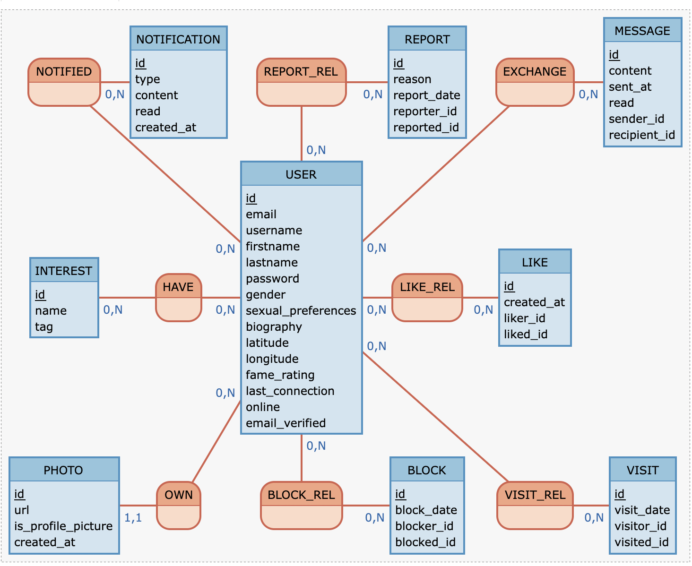
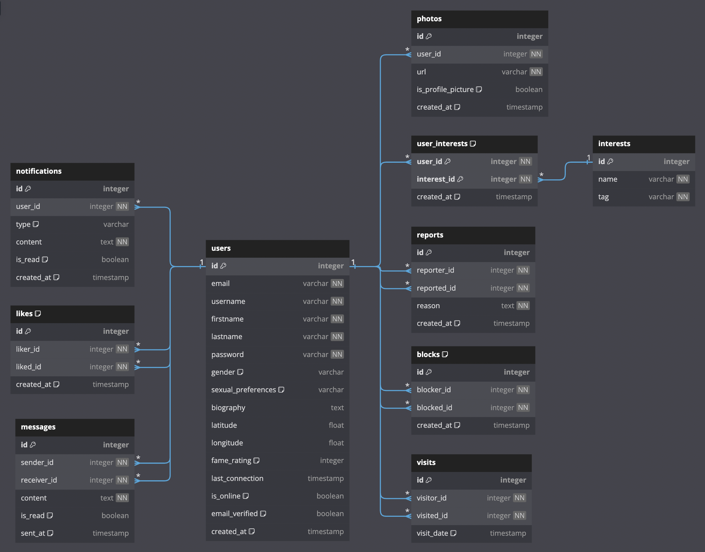

# Matcha - Modern Dating Application

## About The Project
Matcha is a modern dating application developed with TypeScript and Node.js, offering a personalized dating experience based on geolocation and shared interests. Our application emphasizes user safety and matching relevance.

## 🚀 Key Features

- Secure authentication with email verification
- Geolocation system for local matches
- Sophisticated matching algorithm based on common interests
- Real-time chat between connected users
- Fame Rating system
- Profile likes and views management
- Real-time notifications

## 🛠️ Tech Stack

- **Backend**: Node.js with TypeScript
- **Frontend**: React Typescript and Redux
- **Database**: PostgreSQL
- **Containerization**: Docker & Docker Compose
- **Testing**: Jest & Supertest & Playwright & React Testing Library
- **API Documentation**: Swagger
- **Migration Management**: Custom SQL Scripts

## 📦 Prerequisites

- Node.js (v18 or higher)
- Docker and Docker Compose
- npm or yarn

## 🔧 Installation

1. Clone the repository:
```bash
git clone https://github.com/Bilel-Gh/Matcha.git
cd matcha
```

2. Create a `.env` file in the project root:
```env
DB_NAME=matcha
DB_USER=matcha_user
DB_PASSWORD=your_password
NODE_ENV=development
SERVER_PORT=3000
```

3. Launch the application with Docker:
```bash
docker-compose up --build
```

## 🗄️ Database Structure

Our database is managed through a migration system. The main structure includes:

- `users`: User information
- `interests`: Available interests
- `likes`: Like management between users
- `messages`: Messaging system
- `visits`: Profile visit tracking
- And more...


I used [mocodo online](https://www.mocodo.net/) to create this MCD


  I used [DBLM](https://dbml.dbdiagram.io/home/) to create this MLD

## 📝 Available Scripts

```bash
# Development
npm run dev         # Start server in development mode
npm run build      # Compile TypeScript project
npm run start      # Start server in production mode

# Database
npm run db:reset   # Reset database
npm run db:seed    # Add test data
npm run db:migrate # Run migrations

# Testing
npm run test       # Run tests
npm run test:watch # Run tests in watch mode
```

## 🌐 API Documentation

The Swagger API documentation is available at:
```
http://localhost:3000/api-docs
```

## 📁 Project Structure

```
├── Client
│   ├── src
│   │   ├── assets
│   │   ├── components
│   │   ├── hooks
│   │   ├── pages
│   │   ├── services
│   │   ├── store
│   │   ├── utils
│   │   └── App.tsx
│   ├── tests
│   │   ├── e2e
│   │   └── unit
│   ├── package.json
│   └── tsconfig.json
├── Docker
│   ├── Dockerfile.client
│   └── Dockerfile.server
├── Server
│   ├── docs
│   │   └── swagger
│   ├── src
│   │   ├── config
│   │   ├── controllers
│   │   ├── middlewares
│   │   ├── models
│   │   ├── routes
│   │   ├── scripts
│   │   ├── services
│   │   ├── utils
│   │   └── app.ts
│   ├── tests
│   ├── package.json
│   └── tsconfig.json
├── README.md
├── database.dbml
└── docker-compose.yml

```

## 🔐 Security

The application implements several security measures:
- Passwords hashed with bcrypt
- Protection against SQL injections
- User input validation
- Secure session management
- CSRF protection
- Email verification

## 📫 Contact

Bilel Ghandri - bilelghandri@outlook.fr

---

Developed with ❤️ by bghandri from 42 paris school